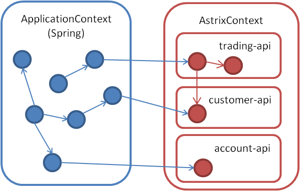

# Part 1 - The IOC container
One of the cornerstones in the design philosophy of Astrix is that Astrix manages the creation and lifecycle of every element that is part of a published api. In this context, a published api is something that is intended to be reused by many different applications within an organization, and often backed by one or more microservices. The api is typically maintained by a single team, and consumed by applications maintained by many other teams. Astrix has similarities with other IOC frameworks like Spring or Guice. However, Astrix is not intended to be used as a standalone IOC-container. Rather Astrix complements another IOC-container acting as a factory to create types that is part of a published api, whereas the other IOC-framework is responsible for wiring all application-beans, some of which are api-beans created by astrix, and managing their lifecycle.

#### Why two IOC-containers?
A typical IOC container like spring is well suited to provide loose coupling between the application objects. A good practice when developing spring applications is to "program against interface's" which means that the different application objects only know each other by interface. This works well for fairly large applications. 

However, a problem arise for large systems consisting of hundreds of microservices, typically developed by different teams/individual's. Sharing libraries and clients in such an organization can lead to difficulties in maintenance if care is not taken to clearly define what is part of the public-api, and what is an internal implementation detail. In large systems it's not only important that the different application objects know each other through an interface, but also that different applications don't know how the libraries and clients provided by other teams are assembled.

Whereas a normal IOC-container inverses the responsibility for application assembly and lifecycle management, Astrix inverses the responsibility for api assembly.

Astrix provides great integration with spring through the `AstrixFrameworkBean`, but is not limited to running within a spring ApplicationContext. The following diagram illustrates the relationship between the beans managed by the spring ApplicationContext and the astrix-beans managed by Astrix.

### ApplicationContext and AstrixContext  


At runtime, every object that is part of an api managed by Astrix is called an astrix-bean, which is similar to a bean in spring. In order for Astrix to be able to create an astrix-bean of a given type, an `ApiProvider` for the given api must exist. Astrix has an extendible `ApiProvider` mechanism, which allows new api "types" to be plugged into Astrix. Two common api types that are supported out of the box are `Library` and `Service`.

A `Library` consist of a number of public interfaces/classes and associated implementations. Astrix shields a library provider from the consumers of the library by allowing the consumer to "program against interfaces" without ever needing to now what implements the given interfaces, or how the classes that implement the interfaces are assembled.

### A Simple Library 
The code for this part can be found [here](../../tree/master/tutorial/src/main/java/tutorial/p1). 

The first step in creating a library is to define the public api. This example only contains a LunchSuggester interface:

```java
public interface LunchSuggester {
	String randomLunchRestaurant();
}
```


The second step is to implement the library. Its a good practice to put the public api and corresponding implementation into different modules, since a consumer of the api have compile-time dependency to the public api, but only a runtime dependency to the implementation.

```java
public class LunchSuggesterImpl implements LunchSuggester {
	
	private Random rnd = new Random();
	
	@Override
	public String randomLunchRestaurant() {
		List<String> restaurants = getAllRestaurants();
		return restaurants.get(rnd.nextInt(restaurants.size()));
	}

	private List<String> getAllRestaurants() {
		return AllLunchRestaurants.ALL_RESTAURANTS;
	}

}
```
Finally, an `ApiProvider` is created to export the library. An `ApiProvider` is what makes the api available as an astrix-api. Two kinds of `ApiProvider` exists and the one associated with libraries is called `AstrixLibraryProvider`. The `ApiProvider` is typically located in the same module as the implementing classes.


```java
@AstrixLibraryProvider
public class LunchLibraryProvider {
	
	@AstrixExport
	public LunchSuggester lunchSuggester() {
		return new LunchSuggesterImpl();
	}

}
```
 
The `@AstrixLibraryProvider` annotation tells Astrix that this class is a library api. Each method annotated with `@AstrixExport` will act as a factory method to create a given api element, which is defined by the return type of the factory method, which is `LunchSuggester` in this example.

### Consuming the Library
Consumption of the LunchApi is done by first creating an `AstrixContext` and then use it as a factory, as in the following unit test.


```java
public class LunchLibraryTest {
	
	private AstrixContext astrix;
	
	@After
	public void after() {
		astrix.destroy();
	}

	@Test
	public void lunchSuggesterCanBeConsumedUsingAstrix() throws Exception {
		AstrixConfigurer configurer = new AstrixConfigurer();
		configurer.setBasePackage("tutorial.t1");
		astrix = configurer.configure();
		
		LunchSuggester lunchSuggester = astrix.getBean(LunchSuggester.class);
		String restaurant = lunchSuggester.randomLunchRestaurant();

		assertTrue(AllLunchRestaurants.ALL_RESTAURANTS.contains(restaurant));
	}
}
```

An AstrixContext is created using an AstrixConfigurer. By default, Astrix won't scan the classpath for api-providers. The `AstrixConfigurer.setBasePackage` tells Astrix to scan the "tutorial.t1" package, and all its subpackages for api-providers. In this case Astrix will find that the `LunchLibraryProvider` provides the `LunchSuggester` api, and use it as a factory to create instances of `LunchSuggester`.

### Injecting Dependencies into a Library
Astrix can inject other astrix-beans into a library. This allows libraries to aggregate services from many sources without burden the consumer of the api to know exactly what services are required by the given library. Lets extend the lunch-library to illustrate injecting astrix-beans into libraries:

First we add another interface to the lunch-api:
```java
public interface LunchRestaurantFinder {
	List<String> getAllRestaurants();
}
```

Second we add an implementation of the new interface, and update the `LunchSuggesterImpl` to use the new `LunchRestaurantFinder`: 

```java
public class LunchRestaurantsFinderImpl implements LunchRestaurantFinder {
	@Override
	public List<String> getAllRestaurants() {
		return AllLunchRestaurants.ALL_RESTAURANTS;
	}
}

public class LunchSuggesterImpl implements LunchSuggester {
	
	private LunchRestaurantFinder lunchRestaurantFinder;
	
	public LunchSuggesterImpl(LunchRestaurantFinder lunchRestaurantFinder) {
		this.lunchRestaurantFinder = lunchRestaurantFinder;
	}

	private List<String> getAllRestaurants() {
		return lunchRestaurantFinder.getAllRestaurants();
	}

}
```

And finally we have to update the `LunchLibraryProvider`. For the point of illustration we are depending on Astrix to inject the LunchRestaurantFinder into the factory-method for `LunchSuggester`:

```java
@AstrixLibraryProvider
public class LunchLibraryProvider {

	@AstrixExport
	public LunchSuggester lunchSuggester(LunchRestaurantFinder restaurantFinder) {
		return new LunchSuggesterImpl(restaurantFinder);
	}

	@AstrixExport
	public LunchRestaurantFinder lunchRestaurantFinder() {
		return new LunchRestaurantsFinderImpl();
	}
}
```

The unittest for the new example looks the same as the first one testing the simple library. When the client (the unit test) creates the LunchSuggester bean the instantiation process goes as follows:

1. Astrix finds the factory-method for `LunchSuggester` and sees that it depends on another astrix-bean, `LunchRestaurantFinder` 
2. Astrix creates the `LunchRestaurantFinder`
3. Astrix injects the `LunchRestaurantFinder` into the factory-method for `LunchSuggester`

This also illustrates another powerful feature of Astrix. Namely that library providers are free to change the implementation of libraries without the need of any source-code changes by any consumers.


### Life Cycle Management of Libraries
Astrix allows created libraries to receive two types of lifecycle events. When a library bean is created Astrix will invoke all `@PostConstruct` annotated methods right after invoking the factory method. When the `AstrixContext` is destroyed (by invoking `AstrixContext.destroy()`) all `@PreDestroy` annotated methods will be invoked on each library bean created by the `AstrixContext`.

This is illustrated by the next example.

```java
public interface LunchRestaurantFinder {
	List<String> getAllRestaurants();
	boolean isInitialized();
	boolean isDestroyed();
}

public class LunchRestaurantFinderImpl implements LunchRestaurantFinder {

	private boolean initialized = false;
	private boolean destroyed = false;

	@Override
	public List<String> getAllRestaurants() {
		return AllLunchRestaurants.ALL_RESTAURANTS;
	}
	
	@PostConstruct
	public void init() {
		this.initialized = true;
	}
	
	@PreDestroy
	public void preDestroy() {
		this.destroyed  = true;
	}

	@Override
	public boolean isInitialized() {
		return initialized;
	}

	@Override
	public boolean isDestroyed() {
		return this.destroyed;
	}

}

public class LibraryLifecycleManagementTest {
	
	private AstrixContext astrix;
	
	@Test
	public void postConstructAnnotatedMethodsAreInvokedWhenTheBeanIsCreated() throws Exception {
		AstrixConfigurer configurer = new AstrixConfigurer();
		configurer.setBasePackage("tutorial.t2");
		astrix = configurer.configure();
		
		LunchRestaurantFinder restaurantFinder = astrix.getBean(LunchRestaurantFinder.class);
		assertTrue(restaurantFinder.isInitialized());
	}
	
	@Test
	public void preDestroyAnnotatedMethodsAreInvokedWhenTheContextIsDestroyed() throws Exception {
		AstrixConfigurer configurer = new AstrixConfigurer();
		configurer.setBasePackage("tutorial.t2");
		astrix = configurer.configure();
		
		LunchRestaurantFinder restaurantFinder = astrix.getBean(LunchRestaurantFinder.class);
		assertFalse(restaurantFinder.isDestroyed());
		
		astrix.destroy();
		assertTrue(restaurantFinder.isDestroyed());
	}
	
}

```

### Testing Libraries
Its a good practice to test your libraries. If your library doesn't depend on any services you can just create an instance of your library using an `AstrixConfigurer`. But most libraries have dependencies on services. After all, thats the whole purpose of using Astrix, to support a service based architecture. In such cases its convenient to test the library isolated from the services it consumes, especially if the consumed service(s) are provided by another team. Astrix makes it really easy to provide test-specific implementations for any service consumed (or actually any astrix-bean) as the following example illustrates.

```java
public class MockingAstrixBeansTest {
	
	@Test
	public void testAstrixConfigurerAllowsRegistrationOfMockInstances() throws Exception {
		LunchRestaurantFinder restaurantFinderStub = Mockito.mock(LunchRestaurantFinder.class);
		TestAstrixConfigurer astrixConfigurer = new TestAstrixConfigurer();
		
		// Register the api(s) we intend to test
		astrixConfigurer.registerApiProvider(LunchLibraryProvider.class);
		
		// Stub out its dependency 
		astrixConfigurer.registerAstrixBean(LunchRestaurantFinder.class, restaurantFinderStub);
		AstrixContext astrixContext = astrixConfigurer.configure();
		
		// Get the api we intend to test
		LunchSuggester lunchSuggester = astrixContext.getBean(LunchSuggester.class);
		
		// Stub out getAllRestaurants to allways return one restaurant
		Mockito.stub(restaurantFinderStub.getAllRestaurants()).toReturn(Arrays.asList("Max"));

		assertEquals("Max", lunchSuggester.randomLunchRestaurant());
	}

	@AstrixLibraryProvider
	public static class LunchLibraryProvider {
		
		// Note that this library don't provide the LunchRestaurantFinder, lets
		// pretend that its a remote-service provided by another team.
		
		@AstrixExport
		public LunchSuggester lunchSuggester(LunchRestaurantFinder restaurantFinder) {
			return new LunchSuggesterImpl(restaurantFinder);
		}
		
	}

}
```
In the example we are using a `TestAstrixConfigurer` instead of the normal `AstrixConfigurer`. A `TestAstrixConfigurer` uses `AstrixConfigurer` behind the scenes, but it creates a configuration suitable for unit testing. It also exposes some functionality not available using the regular `AstrixConfigurer` api, and disables `ApiProvider` scanning. Therefore we programmatically register an `ApiProvider` for the api we intend to test. In the example the api under test depends on another astrix-bean in another api, the `LunchRestaurantFinder`. The `TestAstrixConfigurer.registerAstrixBean` allows us to register a mock for that astrix-bean in the test. Since the creation of a AstrixContext is very fast and we stubbed out the single service dependency, this test will run at "unit test" speed.

[Next: Part 2 - Service Binding](part2.md)  